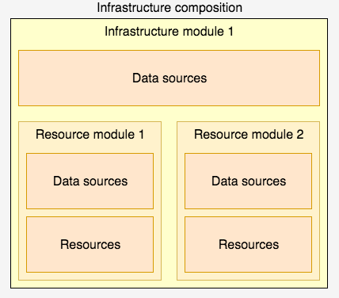

# SSKAI 
## Simple shoddy k3s aws infra

Very simple implementation of 1 ec2 node with k3s running on it behind ALB and NLB for management. 
Two methods - GET accessible from WAN. PUT/POST only from inside EC2 node network.


Repo rollouts everything in one go due to time restrictions.

## Points of improvements
 - Deploy ALBC to provision LB's from k8s
 - Deploy Argo to allow seamless CD
 - Configure cloudwatch
 - Health checks post-install 
 - Add envs instead of one infra directory:  
    ```
    ├── envs
    |   ├──stage
    │   └── dev
    ```
 - Split states of underlying infra and k8s
 - Split states of ec2, lb's, sg's into separate states to have more control over infra
 - ASG instead of plain EC2
 - pre-commit hooks for tf
 - CI to apply changes by having one source of truth(repo) instead of desktop pc
 - Do not store kubeconfig in any way. Should use `ephemeral` when pass into k8s module
 - Do proper k8s installation(e.g. ansible) or refactor k8s module to use values from kubeconfig, not file


### What inside
- EC2+2ALB(int/ext), NLB(ssh/kubeapi), SSM enabled, S3+DynamoDB(commented out)
- k3s, httpbin

## Repo structure
This tf repo in the nutshell `infrastructure module`, but very rough. It's purpose to deploy one cluster with a specific ruleset. 


```
├── README.md
├── docs
│   └── composition-example.png
├── infra
│   ├── README.md
│   ├── main.tf
│   ├── outputs.tf
│   ├── variables.tf
│   └── versions.tf
└── modules
    ├── ec2
    ├── k8s
    ├── lb
    ├── s3-state
    ├── sg
    └── vpc
```

## How to

### Pre-requisites
- AWS terraform user created with an access to creating EC2, IAM, SG, VPC, S3. Easiest way is to give an admin rights to it if you run freetier
- Authorize tf-user as a separate profile
- Terraform >=v1.12

### How to run

1. Create `terraform.tfvars` or `export TF_VAR_admin_cidrs=['xxx.xxx.xxx.0/24]` with your subnet

2. Run
```
cd infra
terraform init
terraform plan
terraform apply
```

### How to test
#### Public

On a local machine run:
```
curl -i http://$(terraform output -raw public_alb_dns_name)/get 
curl -i -X POST http://$(terraform output -raw public_alb_dns_name)/post 
```

Expected result:
- `GET` - 200
- `POST` - 405

#### Internal
On a local machine run:

```
terraform output -raw internal_alb_dns_name

ssh ec2-user@$(terraform output -raw nlb_mgmt_dns_name)
```

On a remote node run:
```
# replace url with internal_alb_dns_name output from earlier
curl -i -X POST http://<internal-alb-url>/post
curl -i -X PUT http://<internal-alb-url>/put
curl -i http://<internal-alb-url>/get
```
Expected result:
- `GET` - 405
- `POST` - 200
- `PUT` - 200

### How to destroy

#### phase 1: remove k8s things first
`terraform destroy -target=module.k8s-httpbin`

#### phase 2: destroy the rest
`terraform destroy`


